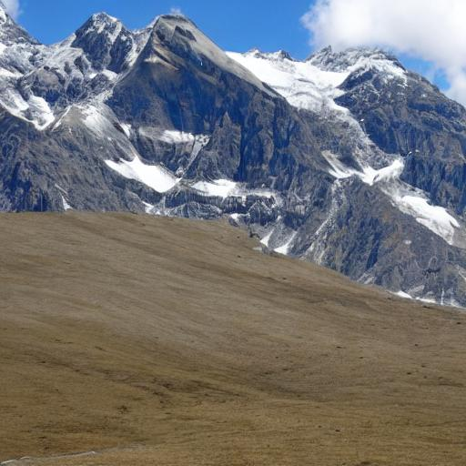
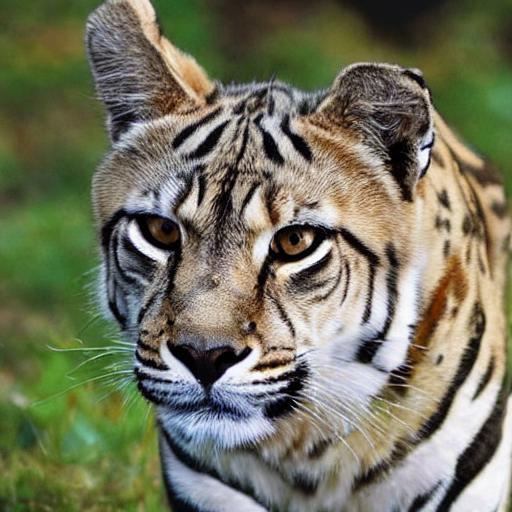

# SpiderFree Visualization

Many-Modal Travel Guide: https://github.com/user-attachments/assets/0a7d4520-aff5-4225-9c10-c6019cedceb6

Many-Modal Generation: https://github.com/user-attachments/assets/114d10ff-bc8b-40d9-af2a-631e930d0e63

Story Generation: https://github.com/user-attachments/assets/da7273e5-2e79-4626-9a64-9e3a30af4e4a

Segmentation: https://github.com/user-attachments/assets/1aeffea1-48e6-4cba-9526-a7700947920f

# Spider Visualization
## Many-modal Travel Guide: Beijing

#### User: 

Please provide me a travel guide for Beijing.

------------------------------------------------------------------------------------------

#### Spider: 

1. Introduction: Beijing, the capital of China, is a city rich in history and culture. It offers a blend of ancient and modern attractions.

2. Attractions

- \<IMAGE\> The Great Wall [IMAGE0] \</IMAGE\>: One of the most iconic landmarks in the world.

  </a>

- \<IMAGE\> The Forbidden City [IMAGE0] \</IMAGE\>: A vast palace complex that served as the home of emperors for centuries.

  </a>

3. Cultures

- \<VIDEO\> Dragon Dance [VIDEO0] \</VIDEO\>: The dragon dance is performed by a team of dancers who manipulate a long flexible dragon puppet using poles.

  <video width="50%" controls>
    <source src="doc/video/Dragon Dance.mp4" type="video/mp4">
    Your browser does not support the video tag.
  </video>

- \<AUDIO\> Peking Opera [AUDIO0] \</AUDIO\>:  Enjoy a traditional Chinese opera performance.

  <audio controls>
    <source src="doc/audio/Peking Opera.mp4" type="audio/mp4">
    Your browser does not support the audio element.
  </audio>

-----------------------------------------------------------------------

#### NExT-GPT: 

Beijing is the capital and largest city of China, and one of the most popular tourist destinations in the world. Here are some tips and tricks to help you make the most of your trip to Beijing:

- Get a visa: Before you leave, make sure you have a Beijing visa, which is usually good for 3 months. You can apply for a visa online or at a Beijing consulate.
- Get your accommodation lined up: Beijing has a wide range of accommodation options, from luxury hotels to budget-friendly options. You can book a hotel online or through a local agency.
- Explore the food: Beijing is known for its delicious food, and there are plenty of places to try. From traditional Chinese cuisine to modern international dishes, there is something for everyone.
- Take a day trip to the Great Wall of Beijing: The Great Wall of Beijing is one of the most famous landmarks in the world, and it's a must-see.

-----------------------------------------------------------------------

##### Discussion: 

Spider generated a many-modal travel guide. But NExT-GPT only generated a textual travel guide.

## Many-modal Travel Guide: Guangzhou

#### User: 

Please provide a travel guide for Guangzhou.

------------------------------------------------------------------------------------------

#### Spider: 

1. Introduction: Guangzhou, is a major city in southern China renowned for its vibrant trade, rich history, and culinary delights.

2. Attractions

- \<IMAGE\>Canton Tower[IMAGE0]\</IMAGE\>: The iconic structure offering panoramic views of the city.

  </a>

- \<IMAGE\>Baiyun Mountain[IMAGE0]\</IMAGE\>: A natural escape with hiking trails and beautiful views of the city.

  </a>

3. Cultural Experiences

- \<VIDEO\>Pearl River Cruise[VIDEO0]\</VIDEO\>: Enjoy a relaxing cruise and admire the illuminated skyline of Guangzhou.

  <video width="50%" controls>
    <source src="doc/video/Pearl River Cruise.mp4" type="video/mp4">
    Your browser does not support the video tag.
  </video>

- \<AUDIO\>Guangzhou Opera House[AUDIO0]\</AUDIO\>: Watch an impressive opera performance in one of the most modern venues in China.

  <audio controls>
    <source src="doc/audio/Guangzhou Opera House.mp4" type="audio/mp4">
    Your browser does not support the audio element.
  </audio>

4. Guangzhou Food and Dining

- \<IMAGE\>Dim Sum[IMAGE0]\</IMAGE\>: A must-try Cantonese tradition, with small dishes like dumplings, buns, and more.

  </a>

- \<IMAGE\>Guangzhou Street Food[IMAGE0]\</IMAGE\>: Explore the food stalls offering roast goose, rice rolls, and congee.

  </a>

- Local Restaurants: Enjoy authentic Cantonese cuisine at renowned establishments throughout the city.
  
5. Guangzhou Shopping

- Beijing Road: A lively pedestrian shopping street with a mix of modern and traditional stores.

- Shangxiajiu Pedestrian Street: Famous for its vibrant atmosphere and local fashion boutiques.

6. Guangzhou Transportation

- Metro: Guangzhou metro system is vast and convenient for traveling across the city.

- Buses: An extensive bus network makes it easy to reach different parts of the city.

7. Guangzhou Tips

- Best Time to Visit: Autumn (October to December) is the best time to visit for pleasant weather.

- Language: Cantonese and Mandarin are both widely spoken, though English may not be as common.

- Currency: The local currency is the Chinese Yuan (CNY).

Explore the dynamic culture and culinary delights of Guangzhou!

-----------------------------------------------------------------------

#### NExT-GPT: 

- Get ready to immerse yourself in the vibrant energy of Guangzhou, China's major city. This bustling metropolis is a harmonious blend of modernity and tradition, offering a diverse range of activities and experiences. Here's your essential travel guide to help you make the most of your time in this dynamic city.

- Get ready to explore the rich history of this ancient city. The most popular tourist attractions in Guangzhou include the crisp air of the Fei metal smelting plant, the towering beauty of the Cividance grandeur, and the iconic beauty of the masterpiece of the essence of the city.

- For those who are interested in local culture, the best way to experience it is by visiting the bustling streets of the city. You can explore the bustling marketplaces, witness the traditional crafts of the region, and try some local delicacies.

-----------------------------------------------------------------------

##### Discussion: 

Spider generated a many-modal travel guide. But NExT-GPT only generated a textual travel guide.

## Many-modal Travel Guide: Tokyo

#### User: 

Please provide a travel guide for Tokyo.

------------------------------------------------------------------------------------------

#### Spider: 

1. Introduction: Tokyo, the capital of Japan, is a bustling metropolis that blends traditional culture with modern innovation.

2. Attractions

- \<IMAGE\>Tokyo Tower[IMAGE0]\</IMAGE\>: An iconic symbol of Tokyo with observation decks offering stunning views.

  </a>

- \<IMAGE\>Shibuya Crossing[IMAGE0]\</IMAGE\>: One of the busiest pedestrian crossings in the world.

  </a>

- \<IMAGE\>Senso-ji Temple[IMAGE0]\</IMAGE\>: Tokyo's oldest temple, located in Asakusa.

  </a>

3. Cultural Experiences

- \<VIDEO\>Sumo Wrestling[VIDEO0]\</VIDEO\>: Experience a traditional Japanese sport.

  <video width="50%" controls>
    <source src="doc/video/Sumo Wrestling.mp4" type="video/mp4">
    Your browser does not support the video tag.
  </video>

- \<VIDEO\>Tea Ceremony[VIDEO0]\</VIDEO\>: Participate in a traditional Japanese tea ceremony.

  <video width="50%" controls>
    <source src="doc/video/Tea Ceremony.mp4" type="video/mp4">
    Your browser does not support the video tag.
  </video>

4. Tokyo Food and Dining

- \<IMAGE\>Sushi[IMAGE0]\</IMAGE\>: Enjoy world-famous sushi at local restaurants.

  </a>

- \<IMAGE\>Ramen[IMAGE0]\</IMAGE\>: A popular Japanese noodle soup available in various styles.

  </a>

- \<IMAGE\>Tempura[IMAGE0]\</IMAGE\>: Lightly battered and fried seafood or vegetables.

  </a>

5. Tokyo Shopping

- Ginza: A luxury shopping district with high-end brands.

- Harajuku: Known for its unique street fashion and shops.

- Akihabara: A haven for electronics and anime culture.

- Shinjuku: A bustling area with shops, restaurants, and entertainment.

6. Tokyo Transportation

- Subway: The Tokyo subway system is efficient and easy to navigate.

- Buses: Public buses cover most areas of the city.

- Taxis: Taxis are available but can be expensive.

7. Tokyo Tips

- Best Time to Visit: Spring (March to May) for cherry blossoms and Autumn (September to November) for pleasant weather.

- Language: Learning a few basic Japanese phrases can be helpful.

- Currency: The local currency is the Japanese Yen (JPY).

Enjoy your trip to Tokyo!

-----------------------------------------------------------------------

#### NExT-GPT: 

Tokyo is a bustling city filled with history, culture, and excitement. Here are some tips and tricks to help you make the most of your trip to this vibrant and dynamic city.

- Get a S created by your airline or travel insurance company. This will help you avoid any delays or cancellations, and also provide you with information about your flight, baggage, and other travel-related services.
- Make sure you have enough time to see everything you want to see. Tokyo is a city that offers something for everyone, from history and culture to modern technology and entertainment. Make sure you plan your itinerary carefully, and don't forget to leave some time for relaxation and exploration.
- Get a reputable guide book or app. There are many guide books available for Tokyo, and many of them are available in multiple languages. These can help you navigate the city, find the best places to eat, and learn about its history and culture.
- Be prepared for the weather. Tokyo can be hot and humid, so make sure you have enough clothing to stay comfortable. 

-----------------------------------------------------------------------

##### Discussion: 

Spider generated a many-modal travel guide. But NExT-GPT only generated a textual travel guide.

## Text + Image → Text + Image

#### User: 

Show me an image that is similar to this image.

  </a>

-----------------------------------------------------------------------

#### Spider:

A mystical forest with glowing mushrooms and a hidden waterfall.
\<IMAGE\> A mystical forest with glowing mushrooms and a hidden waterfall [IMAGE0] \</IMAGE\>

  </a>

-----------------------------------------------------------------------

#### NExT-GPT: 

Certainly! Here's an image that captures the essence of the scene you described, with a group of mushrooms growing amidst a lush forest, creating a captivating and enchanting atmosphere.

  </a>

-----------------------------------------------------------------------

##### Discussion: 

  </a>

User prompt is "Show me an image that is similar to this image".
Spider generated the image that is more similar to the input image, comparing to NExT-GPT.

## Text + Image → Text + Image + Video

#### User: 

Generate an image and a video that are similar to this image.

  </a>

-----------------------------------------------------------------------

#### Spider:

A snowy mountain with a blue sky.
\<IMAGE\> A snowy mountain with a blue sky [IMAGE0] \</IMAGE\>

  </a>

\<VIDEO\> A snowy mountain with a blue sky [VIDEO0] \</VIDEO\>

  <video width="50%" controls>
    <source src="doc/video/A snowy mountain with a blue sky.mp4" type="video/mp4">
    Your browser does not support the video tag.
  </video>

-----------------------------------------------------------------------

#### NExT-GPT: 

Certainly! I can help you with that. Here's an image that is quite similar to the one you described. It showcases a snowy mountain with a large, majestic peak in the distance. The snowy landscape creates a serene and picturesque scene. I'm sure you'll find it visually appealing.

  </a>

-----------------------------------------------------------------------

##### Discussion: 

User prompt is "Generate an image and a video that are similar to this image."
Spider generated an image and a video according to the user prompt. But NExT-GPT only generated an image, failed to generate the video.

## Text → Text + Image + Video

#### User: 

Please generate an image and a video based on the following text: A cat chasing a ball of yarn in a living room.

-------------------------------------------------------------------------
 
#### Spider:

A cat chasing a ball of yarn in a living room.

\<IMAGE\> A cat chasing a ball of yarn in a living room [IMAGE0] \</IMAGE\>

  </a>

\<VIDEO\> A cat chasing a ball of yarn in a living room [VIDEO0] \</VIDEO\>

  <video width="50%" controls>
    <source src="doc/video/A cat chasing a ball of yarn in a living room.mp4" type="video/mp4">
    Your browser does not support the video tag.
  </video>

-----------------------------------------------------------------------

#### NExT-GPT: 

Certainly! I have just the video you're looking for. It captures the delightful moment of a cat p chasing a ball of yarn in a cozy living room. You'll be captivated by the cat's playful nature and the whimsical way it interacts with the colorful yarn.

  <video width="50%" controls>
    <source src="doc/NextGPT/video/A cat chasing a ball of yarn in a living room.mp4" type="video/mp4">
    Your browser does not support the video tag.
  </video>

-----------------------------------------------------------------------

##### Discussion: 

User prompt is "Please generate an image and a video based on the following text: A cat chasing a ball of yarn in a living room."
Spider generated an image and a video according to the user prompt. But NExT-GPT only generated a video, failed to generate the image.

## Text + Image → Box + Image + Video

#### User: 

Detect tiger, and generate an image and a video for it

  </a>

-----------------------------------------------------------------------
#### Spider:

\<BOX\> Tiger [BOX0] \</BOX\>

  </a>

\<IMAGE\> Tiger [IMAGE0] \</IMAGE\>

  </a>

\<VIDEO\> Tiger [VIDEO0] \</VIDEO\>

  <video width="50%" controls>
    <source src="doc/video/tiger.mp4" type="video/mp4">
    Your browser does not support the video tag.
  </video>

-----------------------------------------------------------------------

#### NExT-GPT: 

Sure! Here's an image of a majestic tiger standing proudly, showcasing its powerful presence. You can also find a video of a tiger in action, as well as a box. Enjoy!

  </a>

-----------------------------------------------------------------------

##### Discussion: 

User prompt is "Detect tiger, and generate an image and a video for it".
Spider detected the tiger in the input image, and generated an image and a video according to the user prompt. But NExT-GPT only generated an image, failed to generate the video and detect the tiger in the input image.

## Text + Image → Mask + Image

#### User: 

Give me the mask of panda, and generate an image for it

  </a>

--------------------------------------------------------------------------------   

#### Spider: 

\<MASK\> Panda [MASK0] \</MASK\>

  </a>

\<IMAGE\> Panda [IMAGE0] \</IMAGE\>

  </a>

-----------------------------------------------------------------------

#### NExT-GPT: 

Certainly! I can provide you with an image that captures the essence of the panda in this scene. It's a delightful image of a black and white tiger bear, standing gracefully on a grassy hillside. The bear's black and white fur contrasts beautifully against the green grass, creating a striking visual. The panda appears to be peacefully strolling through the grass, enjoying its surroundings. It's a serene and captivating sight!

  </a>

-----------------------------------------------------------------------

##### Discussion: 

User prompt is "Give me the mask of panda, and generate an image for it".
Spider generated the mask for the panda in the input image, and generated an image according to the user prompt. But NExT-GPT only generated an image, failed to generate the mask for the panda in the input image.

